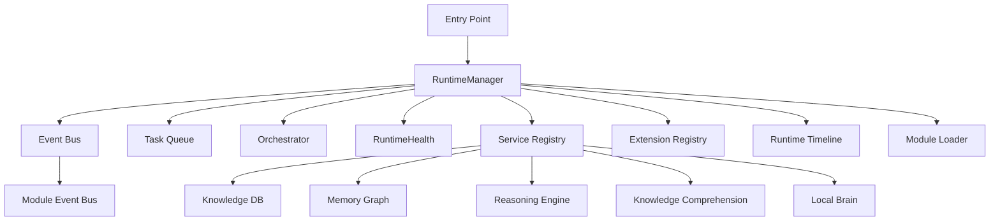
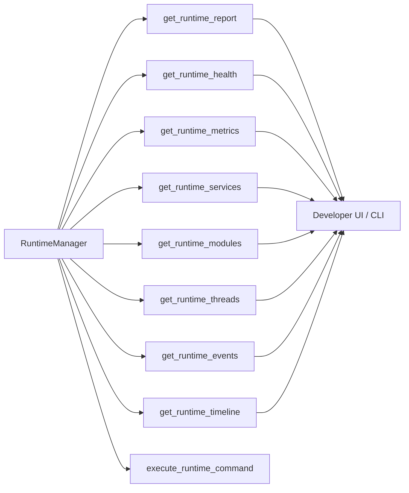
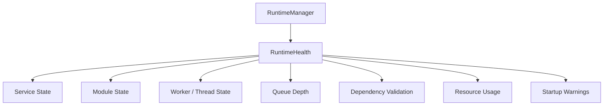
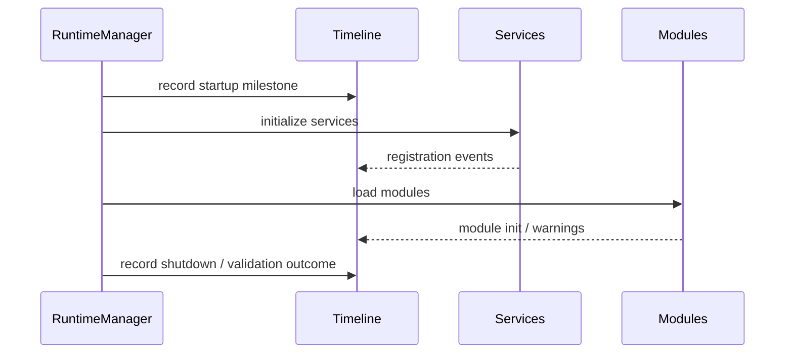

# Niblit Runtime Architecture

## Overview

The Niblit runtime now centers around a deterministic bootstrap contract implemented by RuntimeManager. The manager owns the shared runtime services, tracks lifecycle state, exposes extension points, and publishes a structured runtime report for operators and tests.

## Boot sequence

1. RuntimeManager initialization creates the core event bus, task queue, and orchestrator.
2. Lifecycle transitions move the runtime from created to loaded to ready.
3. Shared services are initialized in a fixed order:
   - knowledge_db
   - memory_graph
   - knowledge_comprehension
   - reasoning_engine
   - local_brain
4. Optional modules are loaded through module_loader and reported as loaded or failed.
5. RuntimeManager bridges core and module-level event streams and exposes the bridge state through diagnostics.

## Lifecycle model

The runtime state is intentionally simple and explicit:

- created: the manager instance exists but services are not yet initialized.
- loaded: services have been created and registered.
- ready: initialization completed and the runtime is available for orchestration.

## Event architecture

The runtime maintains two event surfaces:

- core event bus: used by RuntimeManager and the orchestrator.
- modules event bus: used by module-level components and the broader runtime stack.

RuntimeManager mirrors events between both surfaces so they can remain compatible while the architecture evolves.

## Diagnostics and observability

RuntimeManager now exposes a layered observability surface:

- get_diagnostics(): lightweight service and environment summary.
- get_runtime_report(): structured architecture snapshot including lifecycle state, boot sequence, event bridge state, and extension points.
- get_runtime_health(): runtime health snapshot covering service state, module state, worker count, queue depth, resource usage, dependency validation, and startup warnings.
- get_runtime_metrics(): compact runtime summary used by developer commands and dashboards.
- get_runtime_services(): service registry view.
- get_runtime_modules(): module load and failure view.
- get_runtime_threads(): active worker and thread snapshot.
- get_runtime_events(): recent event-bus history.
- get_runtime_timeline(): structured runtime timeline for startup, services, warnings, and shutdown events.
- execute_runtime_command(): developer command router for runtime.status, runtime.health, runtime.metrics, runtime.services, runtime.modules, runtime.events, runtime.workers, and runtime.report.

These surfaces keep startup behavior inspectable without forcing callers to depend on the internal implementation.

## Runtime health monitor

RuntimeHealth is a lightweight cached monitor that avoids continuous polling. It snapshots the runtime state on demand and reuses the last snapshot when the interval has not elapsed, keeping the overhead low while still making health observable.

## Dependency validation

RuntimeManager validates core dependency availability during startup and records warnings before failures escalate. The validation surface is intentionally lightweight and surfaces dependency issues as structured warnings rather than hard failures.

## Runtime timeline

The runtime timeline records startup milestones, service registration, module initialization, validation warnings, and shutdown events with metadata for timestamp, module, service, severity, duration, and detail.

## Runtime architecture diagram

## Runtime observability diagram

## Runtime health architecture

## Runtime timeline architecture

## New APIs

- get_runtime_report()
- get_runtime_health()
- get_runtime_metrics()
- get_runtime_services()
- get_runtime_modules()
- get_runtime_threads()
- get_runtime_events()
- get_runtime_timeline()
- get_dependency_validation()
- get_startup_warnings()
- register_extension()
- execute_runtime_command()

## New developer commands

- runtime.status
- runtime.health
- runtime.metrics
- runtime.services
- runtime.modules
- runtime.events
- runtime.workers
- runtime.report

## Files modified

- core/runtime_manager.py
- core/runtime_health.py
- test_pdf_ingestion.py
- RUNTIME_ARCHITECTURE.md

## Regression tests

- runtime report
- runtime health
- service registry
- dependency validation
- lifecycle transitions
- runtime timeline
- developer commands

## Performance impact

The added observability layer is intentionally lightweight:

- health snapshots are cached and reused until the interval expires
- runtime timeline events are append-only and bounded to a fixed-size buffer
- no continuous polling loop was introduced
- command execution uses the existing in-memory runtime state

## Remaining architectural recommendations

Before implementing the MemoryManager and cognitive memory system, the next recommended steps are:

1. formalize the extension interface contracts for each future manager
2. introduce a shared dependency injection registry for runtime services
3. split the runtime timeline into structured categories for boot, runtime, and shutdown
4. add a persistent runtime state store for observability snapshots across restarts
5. connect the developer command surface to the CLI and UI entry points

## Extension points

Extension points are registered by name and can be used to add future managers such as:

- memory_manager
- agent_manager
- tool_manager
- model_manager
- task_manager
- plugin_manager

The current contract is intentionally lightweight and can grow into a richer registry over time.
