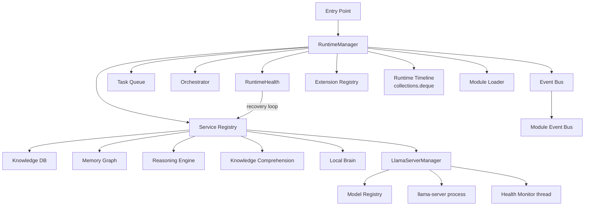
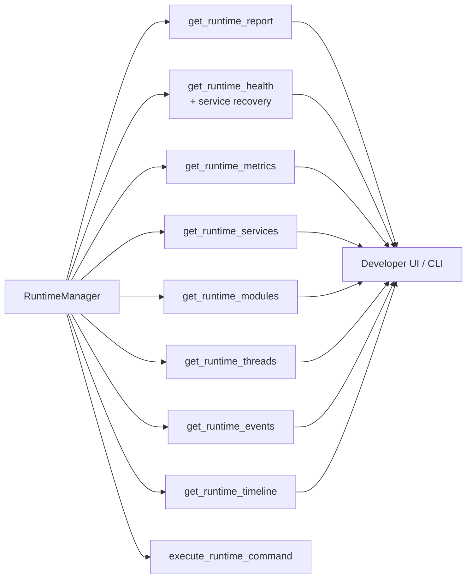
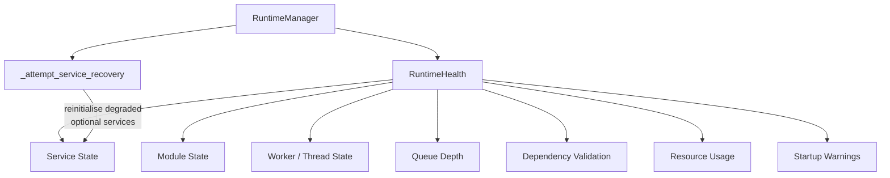
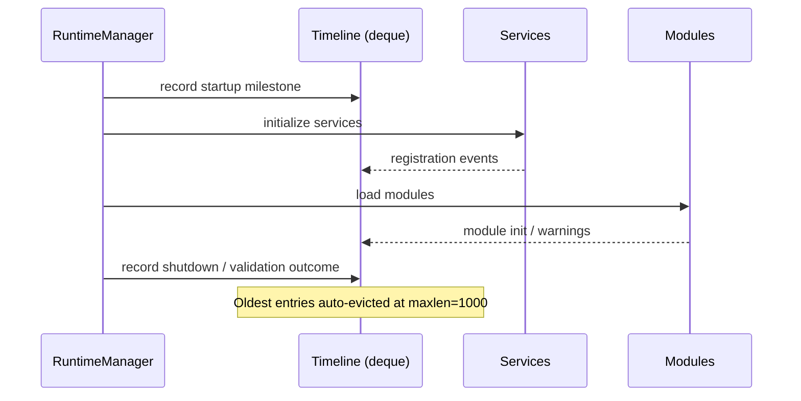
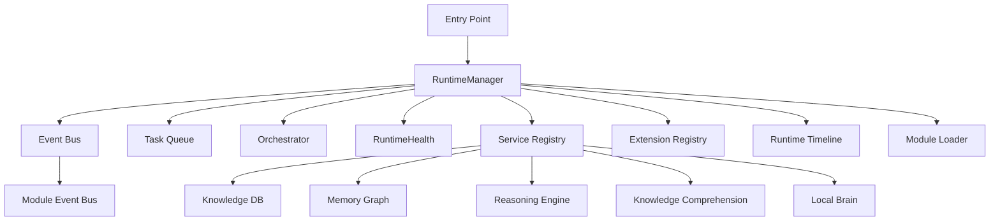
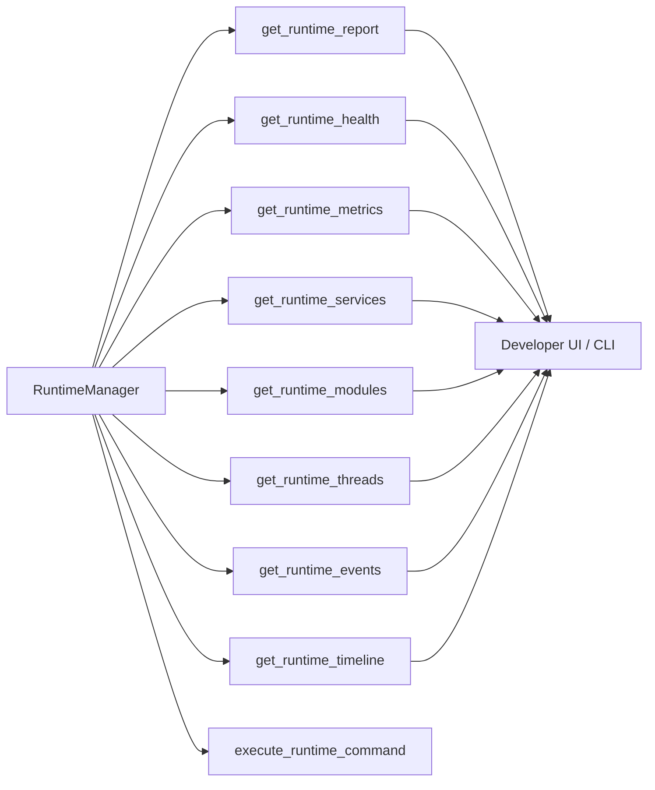
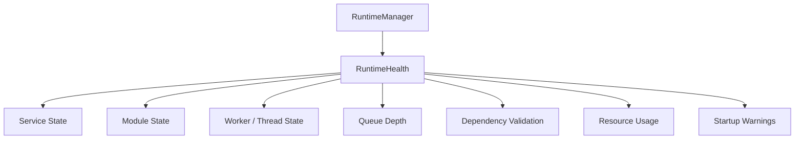
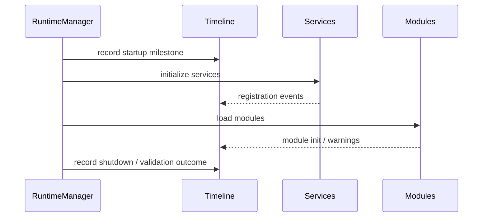

# Niblit Runtime Architecture

## Overview

The Niblit runtime centers around a deterministic bootstrap contract implemented by RuntimeManager. The manager owns the shared runtime services, tracks lifecycle state, exposes extension points, and publishes a structured runtime report for operators and tests.

## Boot sequence

1. RuntimeManager initialization creates the core event bus, task queue, and orchestrator.
2. Lifecycle transitions move the runtime from `created` → `loaded` → `ready`. Transitions are validated against an explicit allow-list; invalid transitions are logged and ignored.
3. Shared services are initialized in a fixed order:
   - **Layer 0** (core infrastructure): `persistence_manager`, `knowledge_db`, `memory_graph`, `memory_router`, `cognitive_memory_layer`, `local_brain`, `knowledge_comprehension`, `reasoning_engine`, `cognitive_synthesis_engine`, `provenance_service`, `runtime_architecture_model`, `cognitive_ingress`
   - **Layer 1** (cognitive feedback): `reflection_engine`, `behaviour_engine`
   - **Layer 2** (optional / graceful): `model_manager`, `llama_server_manager`, `governance_engine`, `structural_awareness`, `ale`, `trading_brain`, `internet_manager`, `repository_manager`
   - **Layer 3** (central coordinator): `foundation_architecture`
4. Optional modules are loaded through `module_loader` and reported as loaded or failed.
5. RuntimeManager bridges core and module-level event streams and exposes the bridge state through diagnostics.

## Lifecycle model

The runtime state is explicit and transition-validated:

- `created`: the manager instance exists but services are not yet initialized.
- `loaded`: services have been created and registered.
- `ready`: initialization completed and the runtime is available for orchestration.
- `stopping`: shutdown has been requested.
- `stopped`: shutdown is complete.

Only the following transitions are permitted; any other attempt is logged as a warning and the state is left unchanged:

| From      | To       |
|-----------|----------|
| created   | loaded   |
| loaded    | ready    |
| created   | ready    |
| ready     | stopping |
| stopping  | stopped  |

## LLM Runtime — Managed llama.cpp server

`modules/llama_server_manager.py` owns the lifecycle of a single `llama-server` process and a registry of discovered GGUF model files.

### Responsibilities

1. **Model discovery** — scans directories listed in `NIBLIT_LLAMA_MODEL_DIRS` (and several well-known default paths) for `.gguf` files; populates `registered_models` with name, path, size, and quantization tag.
2. **Explicit registration** — `register_model(path, name)` adds a model that lives outside the scan directories.
3. **Server lifecycle** — `start()` spawns a `llama-server` subprocess (or adopts an already-running external server); `stop()` terminates the managed process gracefully.
4. **Dynamic model switching** — `switch_model(name)` acquires `_MODEL_SWITCH_LOCK` from `modules.local_brain`, stops the current server, restarts it with the new model, and notifies `local_brain` of the new active URL. The Niblit runtime never needs to restart for a model change.
5. **Health monitoring** — a background daemon thread calls `health_check()` at a configurable interval; if the managed process disappears the service is marked degraded and the runtime recovery loop will attempt reinitialisation.

### Key environment variables

| Variable                   | Default               | Purpose                                        |
|----------------------------|-----------------------|------------------------------------------------|
| `NIBLIT_LLAMA_SERVER_URL`  | `http://127.0.0.1:8080` | llama-server base URL                         |
| `NIBLIT_LLAMA_BINARY_PATH` | (auto-detected)       | Path to `llama-server` binary                  |
| `NIBLIT_LLAMA_MODEL_DIRS`  | (OS-specific defaults)| `os.pathsep`-separated scan directories        |
| `NIBLIT_LLAMA_DEFAULT_MODEL` | (first found)       | Model stem loaded on `start()`                 |
| `NIBLIT_LLAMA_AUTOSTART`   | `0`                   | Set to `1` to start server at runtime init     |
| `NIBLIT_LLAMA_N_CTX`       | `16384`               | Context length for `llama-server`              |
| `NIBLIT_LLAMA_HOST`        | `127.0.0.1`           | Bind host for the managed process              |
| `NIBLIT_LLAMA_PORT`        | `8080`                | Bind port for the managed process              |

### Integration with RuntimeManager

`LlamaServerManager` is registered as the `llama_server_manager` service in Layer 2 of `RuntimeManager.initialize_runtime_services()`.  It is optional: if the binary is not present or model discovery finds nothing the service is marked `degraded` and all other services continue normally.  The accessor `RuntimeManager.get_llama_server_manager()` is available after boot.

## Service recovery

`RuntimeManager.get_runtime_health()` calls `_attempt_service_recovery()` after taking a health snapshot.  Any service listed in `_RECOVERABLE_SERVICES` that is `degraded` and absent from the registry is retried once per health-check call.  Recovered services are transitioned to `ready` and a timeline event is recorded.  This keeps optional services self-healing without requiring a full runtime restart.

Services eligible for auto-recovery: `reflection_engine`, `behaviour_engine`, `model_manager`, `llama_server_manager`, `governance_engine`, `structural_awareness`, `ale`, `internet_manager`.

## Runtime timeline

The timeline is a `collections.deque(maxlen=1000)` (fixed-capacity circular buffer). Appending a new event never allocates a new list; the oldest entry is automatically evicted when the buffer is full.  This keeps memory consumption bounded for long-running sessions.

## Event architecture

The runtime maintains two event surfaces:

- core event bus: used by RuntimeManager and the orchestrator.
- modules event bus: used by module-level components and the broader runtime stack.

RuntimeManager mirrors events between both surfaces so they can remain compatible while the architecture evolves.

## Diagnostics and observability

RuntimeManager exposes a layered observability surface:

- `get_diagnostics()`: lightweight service and environment summary.
- `get_runtime_report()`: structured architecture snapshot including lifecycle state, boot sequence, event bridge state, and extension points.
- `get_runtime_health()`: runtime health snapshot covering service state, module state, worker count, queue depth, resource usage, dependency validation, startup warnings, **and triggers service recovery**.
- `get_runtime_metrics()`: compact runtime summary used by developer commands and dashboards.
- `get_runtime_services()`: service registry view.
- `get_runtime_modules()`: module load and failure view.
- `get_runtime_threads()`: active worker and thread snapshot.
- `get_runtime_events()`: recent event-bus history.
- `get_runtime_timeline()`: structured runtime timeline (deque-backed, bounded at 1000 entries).
- `execute_runtime_command()`: developer command router for `runtime.status`, `runtime.health`, `runtime.metrics`, `runtime.services`, `runtime.modules`, `runtime.events`, `runtime.workers`, and `runtime.report`.

## Runtime health monitor

RuntimeHealth is a lightweight cached monitor that avoids continuous polling. It snapshots the runtime state on demand and reuses the last snapshot when the interval has not elapsed, keeping the overhead low while still making health observable.

## Dependency validation

RuntimeManager validates core dependency availability during startup and records warnings before failures escalate. The validation surface is intentionally lightweight and surfaces dependency issues as structured warnings rather than hard failures.

## Runtime architecture diagram

## Runtime observability diagram

## Runtime health architecture

## Runtime timeline architecture

## New APIs

- `get_runtime_report()`
- `get_runtime_health()` (now includes service recovery)
- `get_runtime_metrics()`
- `get_runtime_services()`
- `get_runtime_modules()`
- `get_runtime_threads()`
- `get_runtime_events()`
- `get_runtime_timeline()`
- `get_dependency_validation()`
- `get_startup_warnings()`
- `register_extension()`
- `execute_runtime_command()`
- `get_llama_server_manager()`

## New developer commands

- `runtime.status`
- `runtime.health`
- `runtime.metrics`
- `runtime.services`
- `runtime.modules`
- `runtime.events`
- `runtime.workers`
- `runtime.report`

## Files modified

- `core/runtime_manager.py` — lifecycle state machine, deque timeline, service recovery, LlamaServerManager integration
- `modules/llama_server_manager.py` — **new** managed llama.cpp server with model discovery and hot-switching
- `test_llama_server_manager.py` — **new** 36-case unit test suite
- `RUNTIME_ARCHITECTURE.md` — this file

## Runtime timeline

The runtime timeline records startup milestones, service registration, module initialization, validation warnings, and shutdown events with metadata for timestamp, module, service, severity, duration, and detail.

## Runtime architecture diagram

## Runtime observability diagram

## Runtime health architecture

## Runtime timeline architecture

## New APIs

- get_runtime_report()
- get_runtime_health()
- get_runtime_metrics()
- get_runtime_services()
- get_runtime_modules()
- get_runtime_threads()
- get_runtime_events()
- get_runtime_timeline()
- get_dependency_validation()
- get_startup_warnings()
- register_extension()
- execute_runtime_command()

## New developer commands

- runtime.status
- runtime.health
- runtime.metrics
- runtime.services
- runtime.modules
- runtime.events
- runtime.workers
- runtime.report

## Files modified

- core/runtime_manager.py
- core/runtime_health.py
- test_pdf_ingestion.py
- RUNTIME_ARCHITECTURE.md

## Regression tests

- runtime report
- runtime health
- service registry
- dependency validation
- lifecycle transitions
- runtime timeline
- developer commands

## Performance impact

The added observability layer is intentionally lightweight:

- health snapshots are cached and reused until the interval expires
- runtime timeline events are append-only and bounded to a fixed-size buffer
- no continuous polling loop was introduced
- command execution uses the existing in-memory runtime state

## Remaining architectural recommendations

Before implementing the MemoryManager and cognitive memory system, the next recommended steps are:

1. formalize the extension interface contracts for each future manager
2. introduce a shared dependency injection registry for runtime services
3. split the runtime timeline into structured categories for boot, runtime, and shutdown
4. add a persistent runtime state store for observability snapshots across restarts
5. connect the developer command surface to the CLI and UI entry points

## Extension points

Extension points are registered by name and can be used to add future managers such as:

- memory_manager
- agent_manager
- tool_manager
- model_manager
- task_manager
- plugin_manager

The current contract is intentionally lightweight and can grow into a richer registry over time.
