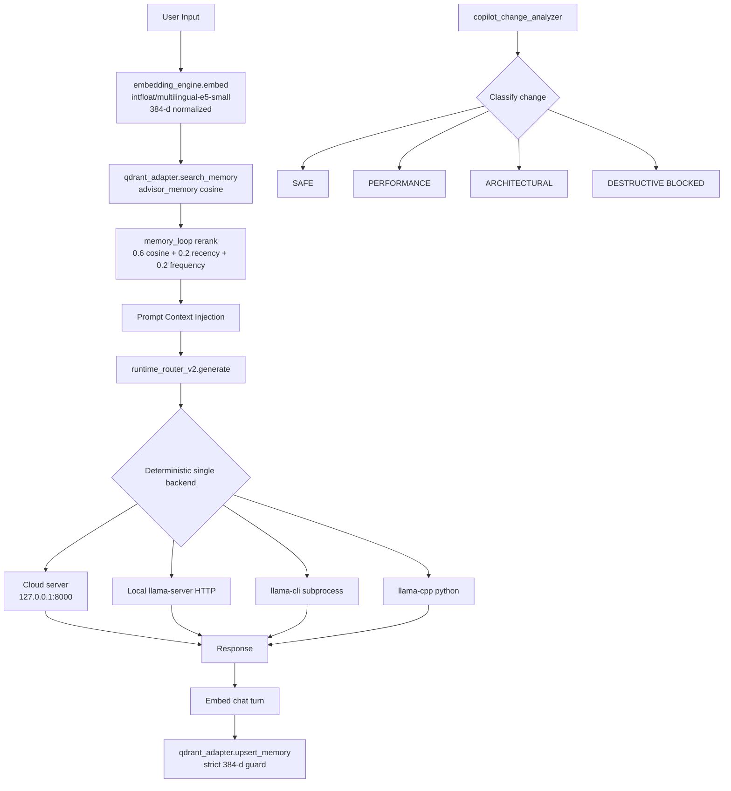

# NRR-v2 Architecture Diagram

```mermaid
flowchart TD
    A[User Input] --> B[embedding_engine.embed\nintfloat/multilingual-e5-small\n384-d normalized]
    B --> C[qdrant_adapter.search_memory\nadvisor_memory cosine]
    C --> D[memory_loop rerank\n0.6 cosine + 0.2 recency + 0.2 frequency]
    D --> E[Prompt Context Injection]
    E --> F[runtime_router_v2.generate]
    F --> G{Deterministic single backend}
    G --> H[Cloud server\n127.0.0.1:8000]
    G --> I[Local llama-server HTTP]
    G --> J[llama-cli subprocess]
    G --> K[llama-cpp python]
    H --> L[Response]
    I --> L
    J --> L
    K --> L
    L --> M[Embed chat turn]
    M --> N[qdrant_adapter.upsert_memory\nstrict 384-d guard]

    O[copilot_change_analyzer] --> P{Classify change}
    P --> P1[SAFE]
    P --> P2[PERFORMANCE]
    P --> P3[ARCHITECTURAL]
    P --> P4[DESTRUCTIVE BLOCKED]
```
